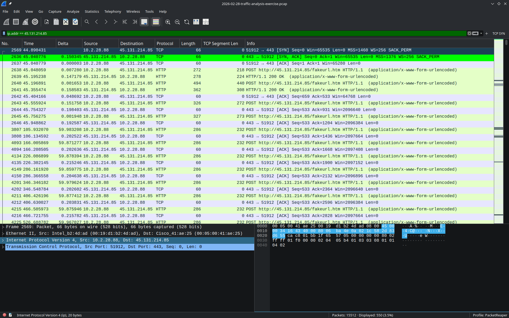
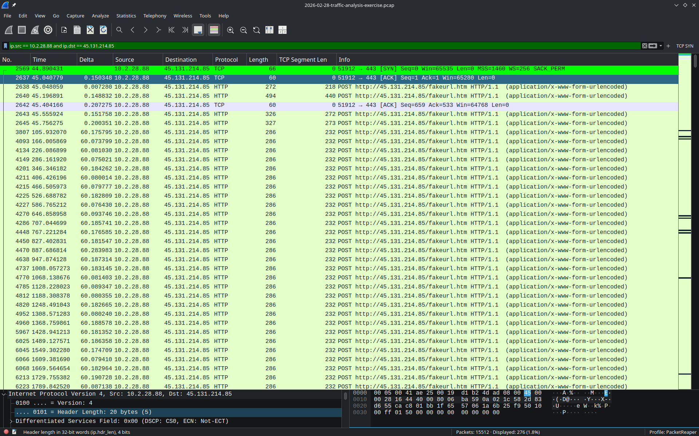
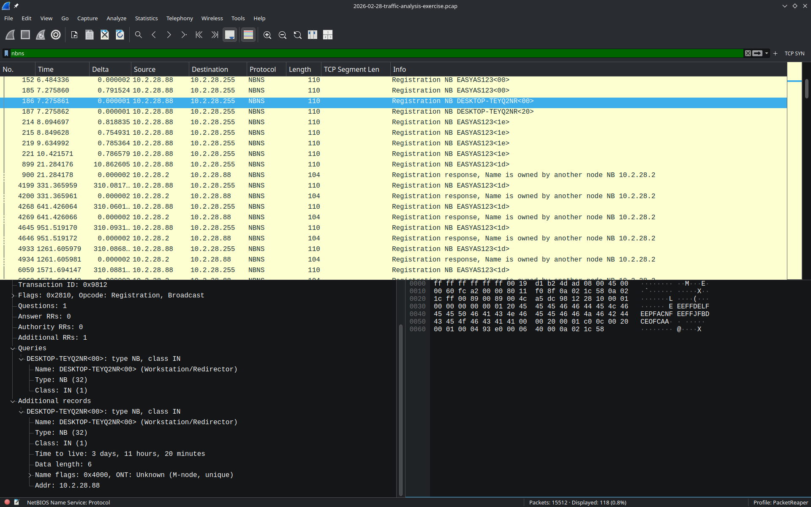
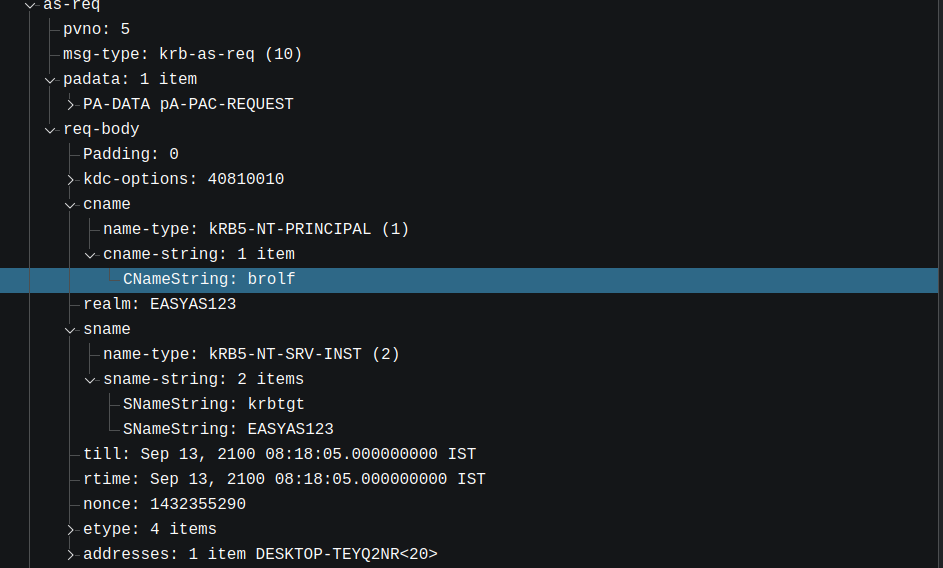

# 🛡️ Security Incident Report

**Incident Type:** Malware Infection (NetSupport Manager RAT)
**Date of Analysis:** 2026-02-28
**Analyst:** Sai Shashank P

---

## 1. Executive Summary

A SIEM alert identified suspicious outbound traffic associated with **NetSupport Manager RAT** communicating with a known malicious IP address (**45.131.214.85**) over TCP port 443.

Packet capture (PCAP) analysis confirmed that an internal host was compromised and engaged in repeated encrypted communication consistent with command-and-control (C2) activity. The affected system and associated user were successfully identified.

---

## 2. Scope of Investigation

* Data Source: Network packet capture (PCAP)
* Network Range: 10.2.28.0/24
* Domain Environment: EASYAS123

---

## 3. Indicators of Compromise (IoCs)

| Type         | Value          |
| ------------ | -------------- |
| Malicious IP | 45.131.214.85  |
| Protocol     | TCP            |
| Port         | 443 (HTTPS)    |
| Threat       | NetSupport RAT |

---

## 4. Affected Asset Details

| Attribute   | Value             |
| ----------- | ----------------- |
| IP Address  | 10.2.28.88        |
| MAC Address | 00:19:d1:b2:4d:ad |
| Hostname    | DESKTOP-TEYQ2NR   |

---

## 5. User Attribution

| Attribute | Value      |
| --------- | ---------- |
| Username  | brolf      |
| Full Name | Becka Rolf |
| Domain    | EASYAS123  |

---

## 6. Investigation Methodology

### 6.1 IoC-Based Traffic Pivot

Filter applied:

```
ip.addr == 45.131.214.85
```

📸 Evidence:


* Identified internal host (10.2.28.88) communicating with malicious IP.

---

### 6.2 Traffic Behavior Analysis

📸 Evidence:


* Repeated outbound connections:

  ```
  10.2.28.88 → 45.131.214.85:443
  ```
* Behavior consistent with encrypted C2 communication.

---

### 6.3 Host Identification (NBNS Analysis)

Filter applied:

```
nbns
```

📸 Evidence:


* Extracted hostname from NBNS registration traffic.

---

### 6.4 User Identification (Kerberos Analysis)

Filter applied:

```
kerberos.CNameString
```

📸 Evidence:


* Extracted username from Kerberos authentication traffic.

---

## 7. Findings

* Host **10.2.28.88 (DESKTOP-TEYQ2NR)** is compromised
* System communicates with known malicious infrastructure
* Communication occurs over encrypted channel (TCP 443)
* Pattern indicates persistent command-and-control activity
* User **brolf (Becka Rolf)** associated with compromised system

---

## 8. Risk Assessment

| Category   | Assessment                                     |
| ---------- | ---------------------------------------------- |
| Severity   | High                                           |
| Impact     | System compromise, potential data exfiltration |
| Likelihood | Confirmed active infection                     |

---

## 9. Recommendations

* Immediately isolate affected host from network
* Block malicious IP (45.131.214.85) at perimeter controls
* Reset credentials for affected user account
* Perform endpoint malware removal and forensic analysis
* Review logs for lateral movement or additional compromise

---

## 10. Conclusion

The investigation confirms that the system **DESKTOP-TEYQ2NR** is infected with NetSupport RAT and actively communicating with an external attacker-controlled server. Immediate containment and remediation actions are required to prevent further impact.

---
