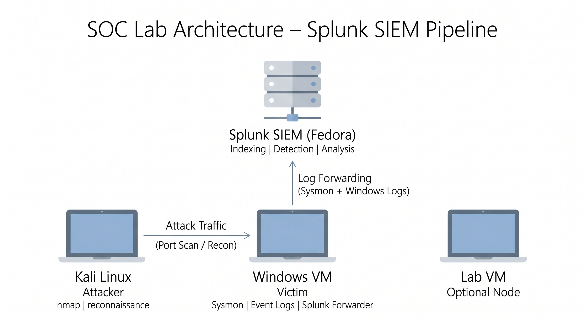

# Splunk SIEM Lab

Focused on SOC Analyst and Detection Engineering use cases.

---

## Key Highlights

* Built a hands-on SOC lab using Splunk to detect real-world attack behaviors
* Developed detections for:

  * Port Scanning (Reconnaissance)
  * C2 Beaconing (Command and Control)
* Performed time-based and statistical analysis (interval and jitter)
* Parsed raw logs using SPL (rex) without relying on pre-extracted fields
* Created SOC-style investigation reports with evidence and MITRE ATT&CK mapping

---

## Tools Used

* Splunk Enterprise
* Sysmon
* Windows Event Logs
* Windows Firewall Logs
* PowerShell (attack simulation)

---

## Detection Cases

* Case 1: Port Scan Detection
  [View Report](./case-1-port-scan-detection/report.md)

* Case 2: C2 Beaconing Detection
  [View Report](./case-2-c2-beaconing-detection/report.md)

---

## What This Lab Demonstrates

* Log ingestion and parsing (Windows Firewall, Sysmon)
* Detection engineering using SPL
* Behavioral analysis (patterns, frequency, timing)
* Identification of attacker techniques
* SOC-style investigation and reporting

---

## Architecture

---

## Methodology

Each detection follows a structured SOC workflow:

1. Log ingestion
2. Field extraction using rex
3. Detection query development
4. Behavioral analysis
5. Evidence validation
6. SOC report documentation

---

## Skills Demonstrated

* Splunk (SPL, field extraction, statistical analysis)
* Log Analysis (Firewall and Sysmon)
* Detection Engineering (behavior-based detection)
* Threat Hunting (reconnaissance and C2 identification)
* MITRE ATT&CK Mapping
* SOC Investigation and Reporting

---

## Detection Outcomes

* Identified port scanning activity targeting multiple service ports
* Detected command-and-control beaconing using time-based analysis
* Validated automated behavior using interval and jitter calculations
* Demonstrated ability to distinguish normal vs malicious traffic patterns

---

## Objective

Demonstrate practical SOC capabilities by:

* Detecting attacker behavior from raw logs
* Building reliable detection logic
* Validating threats using analysis
* Presenting findings in professional SOC reports

---

## Summary

This lab demonstrates the ability to move from raw logs to detection, investigation, and validated threat identification, reflecting real SOC analyst workflows.
