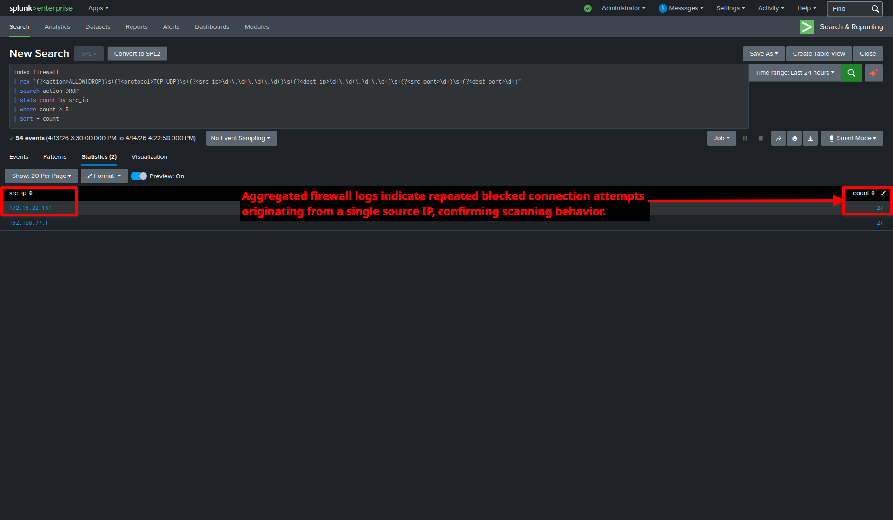
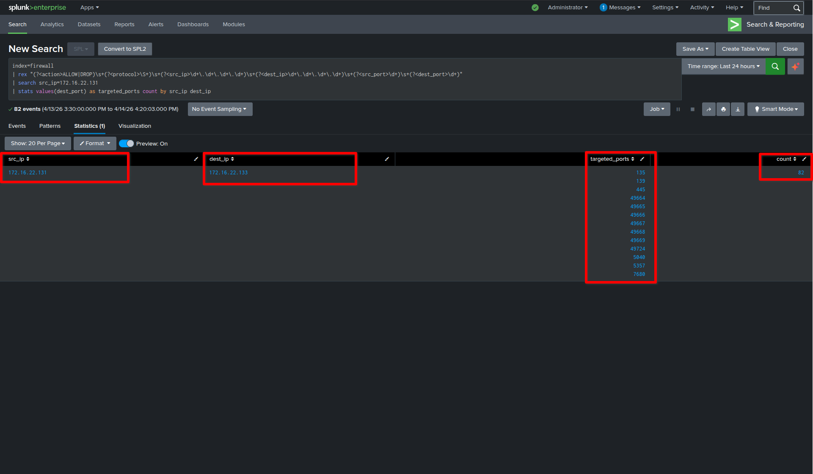
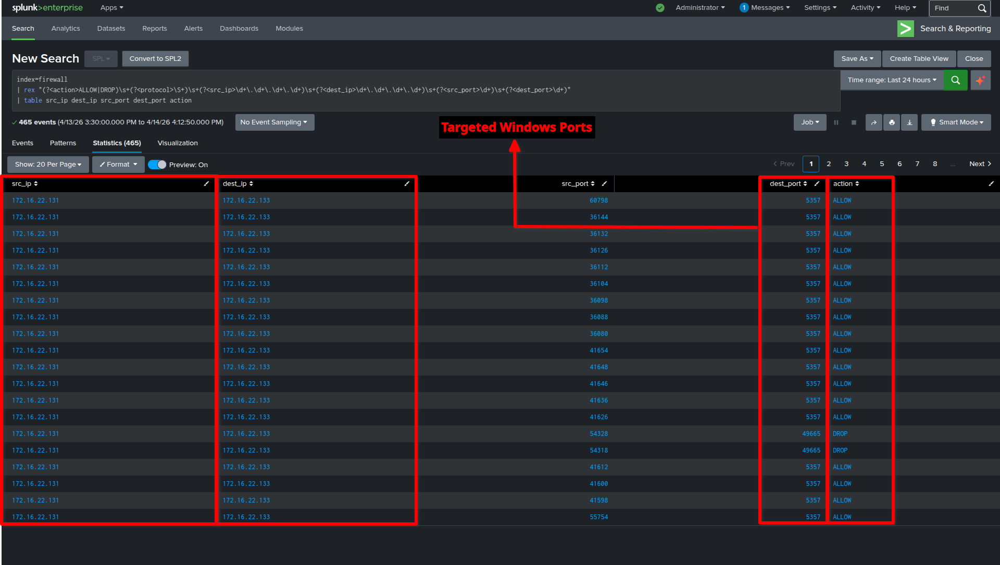
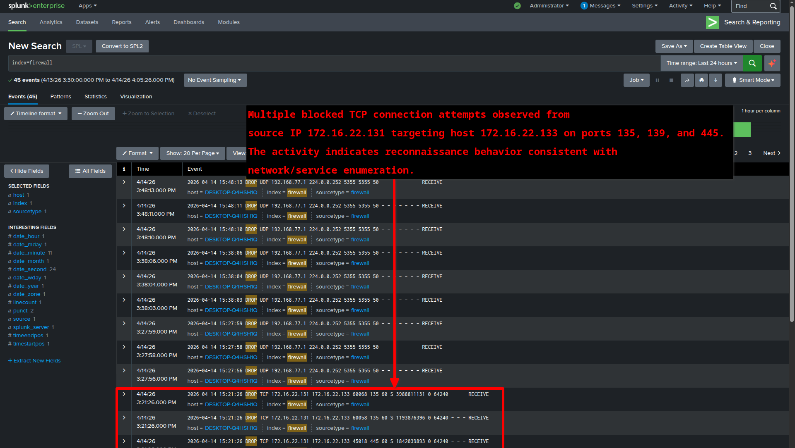

# SOC Incident Report

**Case ID:** SOC-SIEM-LAB-001
**Title:** Detection of Port Scanning Activity via Firewall Logs
**Analyst:** Sai Shashank
**Date:** 2026-04-14

---

## 1. Executive Summary

Firewall telemetry ingested into Splunk identified repeated blocked TCP connection attempts originating from a single source host. The activity targeted multiple Windows service ports, indicating reconnaissance behavior consistent with port scanning. All attempts were successfully blocked.

---

## 2. Environment

* SIEM: Splunk Enterprise
* Data Source: Windows Firewall Logs
* Index: `firewall`
* Attacker: Kali Linux
* Target: Windows system

---

## 3. Detection Logic

### 3.1 Raw Log Search

```spl
index=firewall "DROP TCP"
```

### 3.2 Field Extraction

```spl
index=firewall
| rex "(?<action>ALLOW|DROP)\s+(?<protocol>TCP|UDP)\s+(?<src_ip>\d+\.\d+\.\d+\.\d+)\s+(?<dest_ip>\d+\.\d+\.\d+\.\d+)\s+(?<src_port>\d+)\s+(?<dest_port>\d+)"
| table src_ip dest_ip src_port dest_port action
```

### 3.3 Detection Rule

```spl
index=firewall
| rex "(?<action>ALLOW|DROP)\s+(?<protocol>TCP|UDP)\s+(?<src_ip>\d+\.\d+\.\d+\.\d+)\s+(?<dest_ip>\d+\.\d+\.\d+\.\d+)\s+(?<src_port>\d+)\s+(?<dest_port>\d+)"
| search action=DROP
| stats count by src_ip
| where count > 5
| sort - count
```

### 3.4 Port Enumeration

```spl
index=firewall
| rex "(?<action>ALLOW|DROP)\s+(?<protocol>\S+)\s+(?<src_ip>\d+\.\d+\.\d+\.\d+)\s+(?<dest_ip>\d+\.\d+\.\d+\.\d+)\s+(?<src_port>\d+)\s+(?<dest_port>\d+)"
| search src_ip=172.16.22.131
| stats values(dest_port) as targeted_ports count by src_ip dest_ip
```

---## 4. Evidence

### 4.1 Detection of Suspicious Activity



**Observation:**
Aggregated firewall logs reveal a high number of blocked connection attempts originating from a single source IP (**172.16.22.131**).
The elevated count of events indicates abnormal behavior consistent with automated scanning activity.

---

### 4.2 Port Scanning / Enumeration Behavior



**Observation:**
The source IP (**172.16.22.131**) is observed targeting multiple destination ports on host **172.16.22.133**.
The presence of numerous distinct ports confirms systematic port scanning activity rather than normal communication.

---

### 4.3 Structured Log Analysis



**Observation:**
Parsed firewall logs clearly identify:

* Source IP (attacker)
* Destination IP (target)
* Destination ports
* Action (DROP)

This structured view enables efficient correlation and validation of malicious behavior.

---

### 4.4 Raw Firewall Event Evidence



**Observation:**
Raw Splunk events confirm repeated **DROP TCP** connections targeting critical Windows service ports such as:

* 135 (RPC)
* 139 (NetBIOS)
* 445 (SMB)

These ports are commonly probed during reconnaissance and lateral movement preparation.
---

## 5. Analysis

* Source IP: **172.16.22.131**
* Destination IP: **172.16.22.133**

### Targeted Ports:

* 135 (RPC)
* 139 (NetBIOS)
* 445 (SMB)

### Behavior:

* Multiple ports targeted
* Repeated failed connections
* Sequential probing pattern

**Conclusion:**
Confirmed **port scanning / reconnaissance activity**

---

## 6. MITRE ATT&CK Mapping

* **Technique:** T1046 – Network Service Discovery
* **Tactic:** Discovery

---

## 7. Impact

* No successful compromise
* Firewall blocked all attempts
* No lateral movement observed

---

## 8. Recommendations

* Alert on repeated DROP events
* Detect multi-port access patterns
* Block suspicious IPs
* Expand detection using Sysmon + SIEM correlation

---

## 9. Conclusion

The activity represents a reconnaissance attempt detected through firewall telemetry. Splunk-based analysis successfully identified the attacker, targeted ports, and behavior pattern, demonstrating effective SOC monitoring capability.

---
