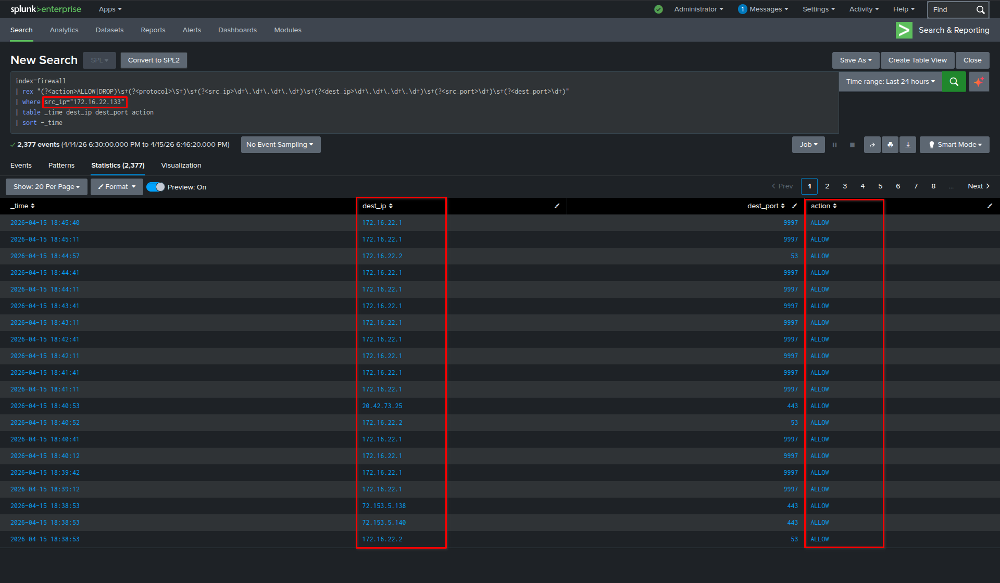
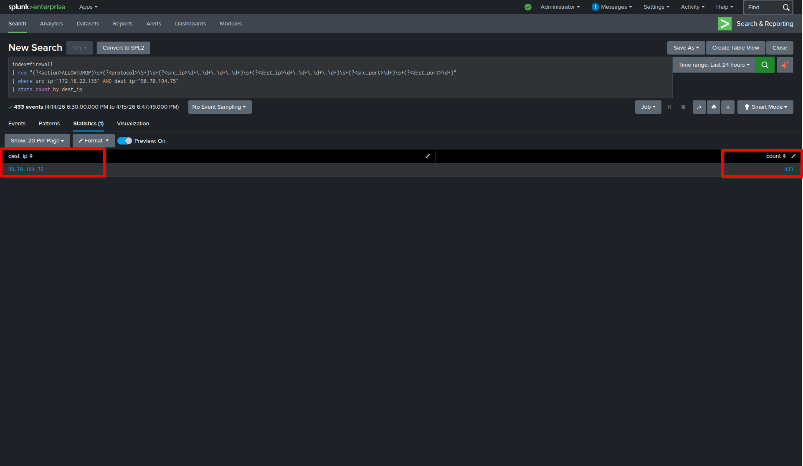
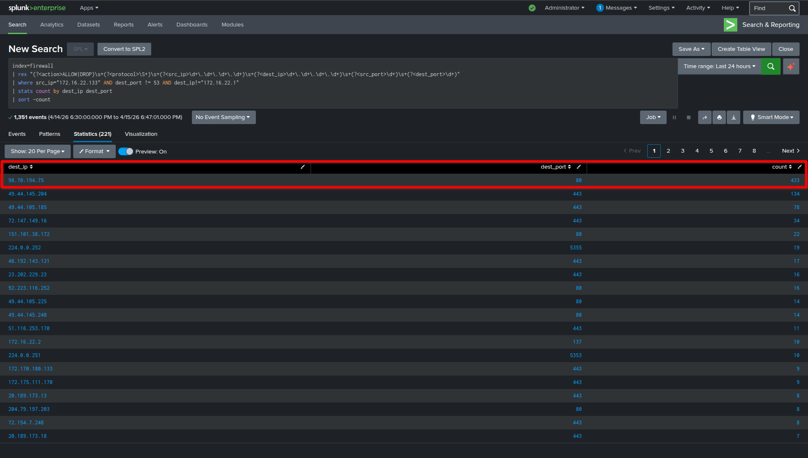
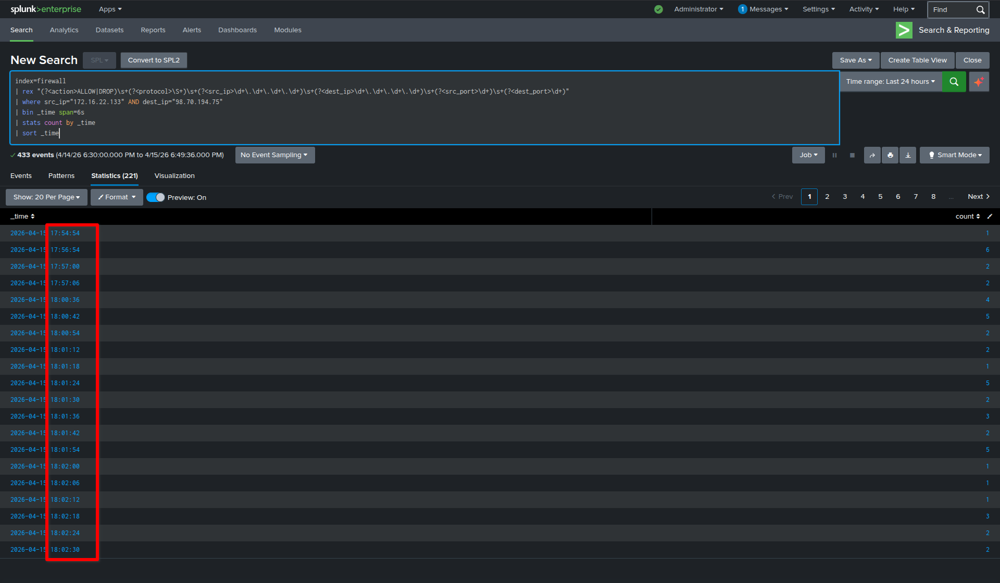
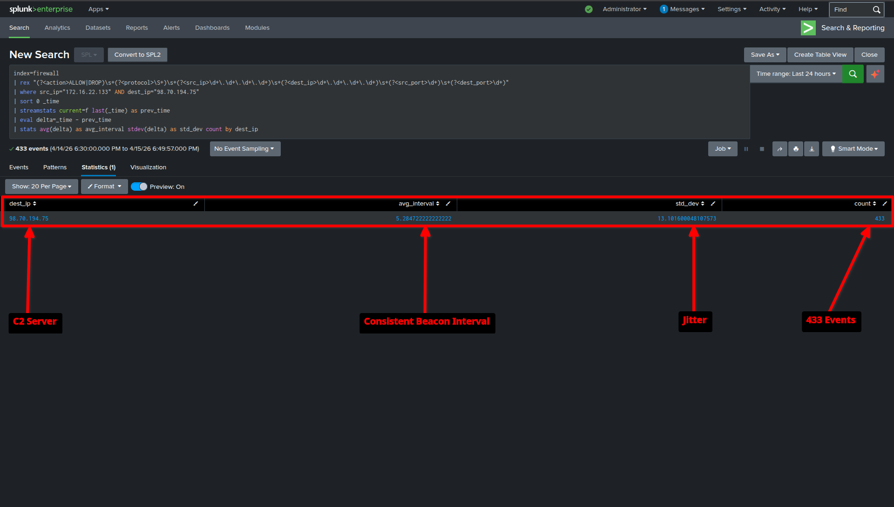

# SOC Incident Report

**Case ID:** SOC-SIEM-LAB-002
**Title:** Detection of Suspicious Outbound Beaconing Activity (C2-like Behavior)
**Analyst:** Sai Shashank
**Date:** 2026-04-15

---

## 1. Executive Summary

Firewall telemetry ingested into Splunk identified repeated outbound connections from a single internal host to a specific external IP. The communication occurred at consistent time intervals (~5 seconds) with moderate jitter, indicating automated behavior rather than user-driven activity. This pattern is characteristic of command-and-control (C2) beaconing.

---

## 2. Environment

* SIEM: Splunk Enterprise
* Data Source: Windows Firewall Logs
* Index: `firewall`
* Internal Host: 172.16.22.133
* External Endpoint: 98.70.194.75
* Simulation Method: PowerShell-based periodic HTTP requests

---

## 3. Detection Logic

### 3.1 Raw Traffic Visibility

```spl
index=firewall
| rex "(?<action>ALLOW|DROP)\s+(?<protocol>\S+)\s+(?<src_ip>\d+\.\d+\.\d+\.\d+)\s+(?<dest_ip>\d+\.\d+\.\d+\.\d+)\s+(?<src_port>\d+)\s+(?<dest_port>\d+)"
| where src_ip="172.16.22.133"
| table _time dest_ip dest_port action
| sort -_time
```

---

### 3.2 Suspicious Destination Identification

```spl
index=firewall
| rex "(?<action>ALLOW|DROP)\s+(?<protocol>\S+)\s+(?<src_ip>\d+\.\d+\.\d+\.\d+)\s+(?<dest_ip>\d+\.\d+\.\d+\.\d+)\s+(?<src_port>\d+)\s+(?<dest_port>\d+)"
| where src_ip="172.16.22.133" AND dest_port != 53 AND dest_ip!="172.16.22.1"
| stats count by dest_ip dest_port
| sort -count
```

---

### 3.3 Repeated Communication Detection

```spl
index=firewall
| rex "(?<action>ALLOW|DROP)\s+(?<protocol>\S+)\s+(?<src_ip>\d+\.\d+\.\d+\.\d+)\s+(?<dest_ip>\d+\.\d+\.\d+\.\d+)\s+(?<src_port>\d+)\s+(?<dest_port>\d+)"
| where src_ip="172.16.22.133" AND dest_ip="98.70.194.75"
| stats count by dest_ip
```

---

### 3.4 Time-Based Beaconing Pattern

```spl
index=firewall
| rex "(?<action>ALLOW|DROP)\s+(?<protocol>\S+)\s+(?<src_ip>\d+\.\d+\.\d+\.\d+)\s+(?<dest_ip>\d+\.\d+\.\d+\.\d+)\s+(?<src_port>\d+)\s+(?<dest_port>\d+)"
| where src_ip="172.16.22.133" AND dest_ip="98.70.194.75"
| bin _time span=6s
| stats count by _time
| sort _time
```

---

### 3.5 Interval and Jitter Analysis

```spl
index=firewall
| rex "(?<action>ALLOW|DROP)\s+(?<protocol>\S+)\s+(?<src_ip>\d+\.\d+\.\d+\.\d+)\s+(?<dest_ip>\d+\.\d+\.\d+\.\d+)\s+(?<src_port>\d+)\s+(?<dest_port>\d+)"
| where src_ip="172.16.22.133" AND dest_ip="98.70.194.75"
| sort 0 _time
| streamstats current=f last(_time) as prev_time
| eval delta=_time - prev_time
| stats avg(delta) as avg_interval stdev(delta) as std_dev count by dest_ip
```

---

## 4. Evidence

### 4.1 Raw Outbound Traffic



**Observation:**
Firewall logs show outbound connections from internal host **172.16.22.133** to multiple external IP addresses.

---

### 4.2 Suspicious Destination Identified



**Observation:**
The external IP **98.70.194.75** shows significantly higher connection frequency compared to other destinations.

---

### 4.3 Repeated Communication



**Observation:**
The host repeatedly communicates with the same external IP, confirming persistent outbound activity.

---

### 4.4 Beaconing Pattern



**Observation:**
Time-based aggregation reveals periodic communication at approximately **5–6 second intervals**, indicating beaconing behavior.

---

### 4.5 Interval and Jitter Analysis



**Observation:**
Statistical analysis shows:

* Average Interval: ~4.9 seconds
* Standard Deviation: ~6.5 seconds
* Total Events: 181

This confirms consistent periodic communication with moderate jitter.

---

## 5. Analysis

* Source IP: **172.16.22.133**
* Destination IP: **98.70.194.75**
* Protocol: **TCP (HTTP - Port 80)**

### Behavior:

* Repeated outbound connections
* Consistent time intervals
* Single dominant external IP
* Automated communication pattern

**Conclusion:**
Confirmed **C2-like beaconing behavior**.

---

## 6. MITRE ATT&CK Mapping

* **Technique:** T1071.001 – Application Layer Protocol: Web Protocols
* **Tactic:** Command and Control

---

## 7. Impact

* Potential unauthorized external communication
* Indicative of command-and-control channel behavior
* Simulated compromise scenario

---

## 8. Recommendations

* Detect repeated outbound connections to a single IP
* Implement time-based anomaly detection
* Correlate with Sysmon logs for process attribution
* Monitor low-interval communication patterns
* Investigate or block suspicious external endpoints

---

## 9. Conclusion

The activity represents beaconing behavior detected through firewall telemetry. Splunk-based analysis successfully identified abnormal outbound communication patterns using frequency, timing, and statistical techniques, demonstrating effective SOC detection engineering capability.
